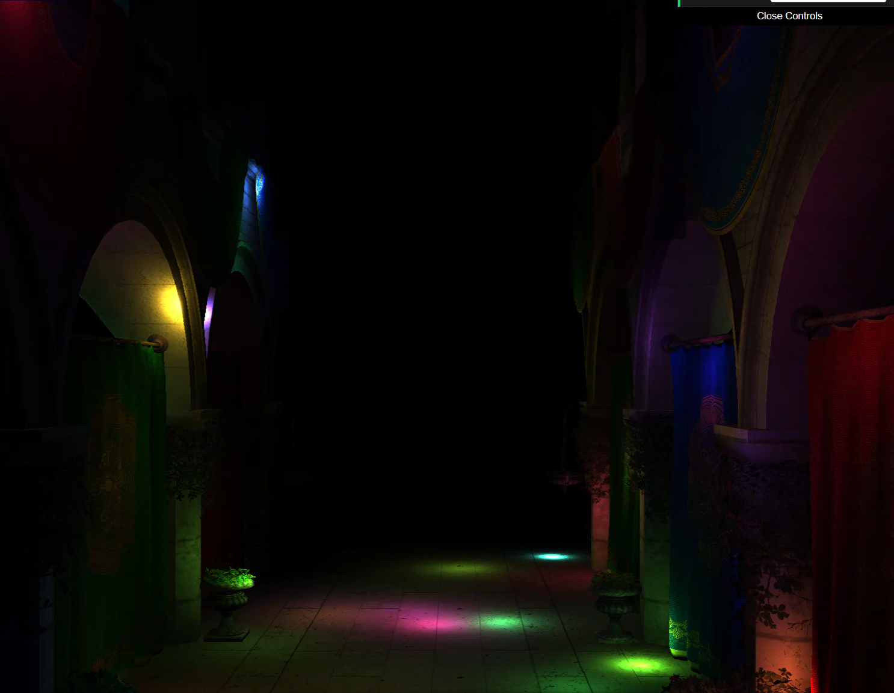

# WebGPU Forward+ and Clustered Deferred Shading
======================

**University of Pennsylvania, CIS 565: GPU Programming and Architecture, Project 4**

* Cindy Wei
* Tested on: **Google Chrome 119.0** on Windows 11, i7-12700H @ 2.30GHz 16GB, NVIDIA RTX 3060 6GB

## Project Description

This project implements and compares three modern real-time rendering techniques for handling many dynamic lights using WebGPU. The implementation demonstrates the significant performance advantages of advanced lighting techniques over traditional approaches, with comprehensive performance analysis showing up to 34x speed improvements.

## Features Implemented

### Core Rendering Techniques
- **Naive Forward Rendering** 🐌: Baseline implementation testing every light for every fragment
- **Forward+ Rendering** ⚡: Light clustering compute shader for efficient light culling
- **Clustered Deferred Rendering** 🧊: G-buffer approach with separate geometry and lighting passes

### Advanced Features
- **Real-time Performance Analysis**: Built-in frame time and FPS measurement for all renderers
- **Dynamic Light System**: Support for 2000+ moving lights with real-time updates
- **Light Clustering Compute Shader**: Efficient spatial partitioning for light assignment
- **G-buffer Implementation**: Position, normal, and albedo texture storage
- **Interactive GUI**: Real-time renderer switching and parameter control

## Live Demo

*Click the image above to view the live WebGPU rendering demo*

## Demo Video/GIF

*demo showing all three renderers, dynamic light movement, and real-time performance characteristics (500 - 1000 lights)*

### Individual Renderer Performance (2000 Lights)
| Naive Renderer 🐌 | Forward+ Renderer ⚡ | Clustered Deferred 🧊 |
|-------------------|---------------------|----------------------|
|  |  |  |

*Click each GIF to view individual renderer performance with 2000 dynamic lights*

## Performance Analysis

### Methodology
Comprehensive performance testing across all three renderers with light counts ranging from 100 to 2000 lights. Real-time measurements include:
- Average frame time (milliseconds)
- Frames per second (FPS) 
- Minimum and maximum frame times
- Performance scaling analysis

### Performance Results

### Performance Data Summary

| Light Count | Naive 🐌 | Forward+ ⚡ | Clustered Deferred 🧊 |
|-------------|----------|------------|----------------------|
| 100 lights  | 134ms / 7.5 FPS | 85ms / 11.8 FPS | 38ms / 26.3 FPS |
| 500 lights  | 650ms / 1.5 FPS | 298ms / 3.4 FPS | 86ms / 11.6 FPS |
| 1000 lights | 1297ms / 0.8 FPS | 200ms / 5.0 FPS | 86ms / 11.6 FPS |
| 2000 lights | 2916ms / 0.3 FPS | 212ms / 4.7 FPS | 86ms / 11.6 FPS |

### Key Performance Findings

**Massive Performance Improvements:**
- **34x speedup** with Clustered Deferred vs Naive (2000 lights)
- **39x FPS improvement** with Clustered Deferred vs Naive (2000 lights) 
- **15x speedup** with Clustered Deferred vs Forward+ (1000 lights)
- **Consistent performance** with Clustered Deferred regardless of light count

**Scalability Analysis:**
- **Clustered Deferred**: Excellent scalability - performance plateaus at 86ms
- **Forward+**: Good scalability - linear performance degradation from 85ms to 212ms
- **Naive**: Poor scalability - exponential performance collapse from 134ms to 2916ms

### Performance Improvement (vs Naive)

| Light Count | Speedup | FPS Multiplier |
|-------------|---------|----------------|
| 100 lights  | 3.6x    | 3.5x           |
| 500 lights  | 7.6x    | 7.7x           |
| 1000 lights | 15.1x   | 14.5x          |
| 2000 lights | 33.9x   | 38.7x          |

### Technical Insights

**Why Clustered Deferred Performs Best:**
- **Fixed overhead**: Geometry pass cost is constant regardless of light count
- **Efficient culling**: Only relevant lights processed per pixel using cluster data
- **Memory coherence**: G-buffer allows optimized memory access patterns
- **Parallel lighting**: Independent lighting calculations per pixel

**Forward+ Limitations:**
- **Per-fragment overhead**: Still processes lighting in fragment shader
- **Cluster management**: Additional compute shader overhead for light assignment
- **Memory bandwidth**: Reads light lists per fragment from storage buffers

**Naive Bottlenecks:**
- **O(n×m) complexity**: Every light tested for every fragment
- **No culling**: Inefficient for scenes with many lights
- **Shader complexity**: Complex branching and loop unrolling in fragment shader

## Implementation Details

### WebGPU Architecture

**Compute Shaders:**
- Light movement and animation
- Cluster assignment and light culling
- Real-time performance monitoring

**Render Pipelines:**
- Naive: Single-pass forward rendering
- Forward+: Clustered lighting in fragment shader  
- Clustered Deferred: Two-pass (geometry + lighting) with G-buffer

**Resource Management:**
- Storage buffers for light and cluster data
- Uniform buffers for camera matrices
- Texture arrays for G-buffer storage
- Bind group layouts for efficient resource binding

### Key Code Features

- **TypeScript** for type-safe WebGPU abstraction
- **WGSL shaders** with modern GPU programming patterns
- **Real-time performance profiling** with console output
- **Dynamic resource creation** for different renderer requirements
- **Efficient scene traversal** for model and material binding

### Credits

- [Vite](https://vitejs.dev/)
- [loaders.gl](https://loaders.gl/)
- [dat.GUI](https://github.com/dataarts/dat.gui)
- [stats.js](https://github.com/mrdoob/stats.js)
- [wgpu-matrix](https://github.com/greggman/wgpu-matrix)
